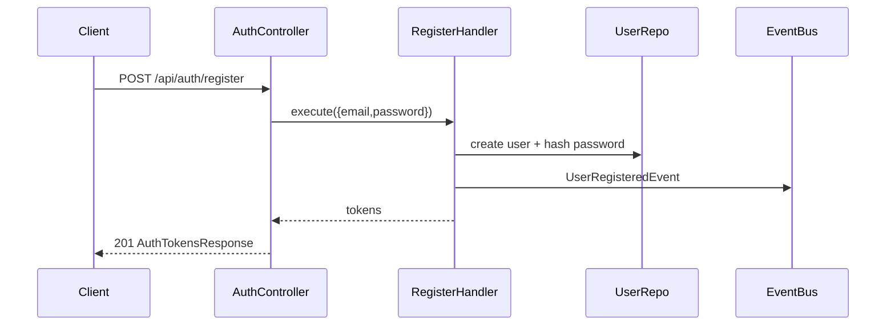

# Feature Design: Authentication and Profile Bootstrap

## Feature summary
Build the first production-grade vertical slice for platform access:
- User sign-up and sign-in with Passport local strategy and JWT issuance.
- Protected `me` query endpoint for authenticated user profile retrieval.
- Full Request-Handler-Response contract pattern with OpenAPI definitions.
- CQRS and domain event hooks for future integrations.

This feature is the foundation for all subsequent protected capabilities in API and mobile.

## User-facing behavior
- A new user can create an account with email/password.
- A user can sign in and receive access/refresh tokens.
- A signed-in user can fetch their own profile.
- Invalid credentials return a stable auth error contract.
- Unauthenticated profile requests return HTTP 401.

## Impacted slices
- API:
  - `apps/api/src/features/auth/api`
  - `apps/api/src/features/auth/application`
  - `apps/api/src/features/auth/domain`
  - `apps/api/src/features/auth/infrastructure`
  - `apps/api/src/features/users/api`
  - `apps/api/src/features/users/application`
  - `apps/api/src/features/users/domain`
  - `apps/api/src/features/users/infrastructure`
  - `apps/api/src/infrastructure` (Passport strategies, guards)
  - `apps/api/src/types` (enums/constants/types)
  - `apps/api/src/api` (controller exposure)
- Mobile:
  - `apps/mobile` login/bootstrap auth state integration with TanStack Query
- Contracts/SDK:
  - `packages/contracts` OpenAPI output
  - `packages/client-sdk` Orval-generated client

## API endpoints and schemas

### POST /api/auth/register
- Purpose: create a user account.
- Request DTO (`RegisterRequest`):
  - `email: string` (`@IsEmail`, required)
  - `password: string` (`@MinLength(8)`, required)
  - OpenAPI schema example included.
- Handler (`RegisterHandler`):
  - Input: `{ email, password }`
  - Output: `AuthTokensResult`
  - Logic: ensure email uniqueness, hash password, create user, emit `UserRegistered`.
- Response DTO (`AuthTokensResponse`):
  - `accessToken: string`
  - `refreshToken: string`
  - `expiresIn: number`

### POST /api/auth/login
- Purpose: authenticate existing user.
- Request DTO (`LoginRequest`):
  - `email: string` (`@IsEmail`)
  - `password: string` (`@IsString`)
- Handler (`LoginHandler`):
  - Input: `{ email, password }`
  - Output: `AuthTokensResult`
  - Logic: verify password hash, emit `UserLoggedIn`.
- Response DTO (`AuthTokensResponse`): same as register.

### GET /api/users/me
- Purpose: return authenticated user profile.
- Auth: `JwtAuthGuard`.
- Request DTO (`GetMeRequest`):
  - Transport request has no body; auth context carries `userId`.
- Handler (`GetMeHandler`):
  - Input: `{ userId }`
  - Output: `UserProfileResult`
  - Logic: query user projection by id.
- Response DTO (`UserProfileResponse`):
  - `id: string`
  - `email: string`
  - `createdAt: string` (ISO)

### Error contract (shared)
- `ApiErrorResponse`:
  - `code: string`
  - `message: string`
  - `details?: Record<string, unknown>`
- Auth-specific codes:
  - `AUTH_INVALID_CREDENTIALS`
  - `AUTH_EMAIL_IN_USE`
  - `AUTH_UNAUTHORIZED`

## Command/query handlers (CQRS)

### Commands
- `RegisterUserCommand` -> `RegisterUserCommandHandler`
- `LoginUserCommand` -> `LoginUserCommandHandler`

### Queries
- `GetCurrentUserQuery` -> `GetCurrentUserQueryHandler`

### Handler boundaries
- Handlers only consume plain input models and infrastructure ports.
- Handlers do not depend on Nest `Request` object.
- API controllers map DTOs/auth context to handler input/output models.

## Domain events
- `UserRegisteredEvent`
  - Trigger: successful registration.
  - Initial consumers:
    - audit logger (infrastructure)
    - placeholder notification handler (no external send yet)
- `UserLoggedInEvent`
  - Trigger: successful login.
  - Initial consumers:
    - audit logger

## Data model changes

### Prisma model additions/changes
- Extend `User` model:
  - `passwordHash String`
  - `isActive Boolean @default(true)`
- Add `RefreshToken` model:
  - `id String @id @default(cuid())`
  - `userId String`
  - `tokenHash String`
  - `expiresAt DateTime`
  - `revokedAt DateTime?`
  - relation to `User`
- Add indexes:
  - `@@index([userId, expiresAt])`

### Migration shape
- Add columns/table only (additive).
- Backfill not required for fresh environment.

## Security and auth notes
- Passport local strategy for email/password login.
- Passport JWT strategy for route protection.
- Password hashing with strong one-way algorithm (bcrypt/argon2).
- Refresh tokens stored hashed in DB (never plaintext).
- Auth errors use non-enumerating messages where possible.
- Future: rotate refresh tokens on use and support revoke-all sessions.

## Generated contract impact
- Swagger:
  - Add auth and users tags.
  - Add bearer auth scheme and endpoint docs.
  - Expose response/error DTO schemas.
- Orval:
  - Generate SDK methods:
    - `postApiAuthRegister`
    - `postApiAuthLogin`
    - `getApiUsersMe`
  - Generate typed hooks wrappers for TanStack Query usage in mobile.

## Backward compatibility notes
- Additive only; no existing endpoint contract break.
- New auth endpoints and guard-protected `me` endpoint do not alter current behavior.

## Testing matrix
- Unit:
  - Register/login handler happy paths.
  - Register duplicate email rejection.
  - Login invalid password rejection.
  - GetMe query not found/disabled user behavior.
- Integration:
  - Controller + guard + validation for all 3 endpoints.
  - OpenAPI document includes schemas and security metadata.
- E2E:
  - register -> login -> me flow.
  - unauthorized me returns 401.

## Rollout strategy
- Phase 1: release endpoints disabled from UI (API only).
- Phase 2: mobile login integration behind feature flag.
- Phase 3: remove flag once telemetry confirms stable auth success/error rates.

## Implementation slices (small PRs)
1. Auth domain + Prisma migration
- Add Prisma schema changes and migration.
- Add repository ports and concrete Prisma adapters.

2. Register endpoint (Request-Handler-Response)
- Add DTOs, command handler, controller route, validation, OpenAPI annotations.

3. Login endpoint (Request-Handler-Response)
- Add Passport local strategy usage and token issuance flow.

4. JWT guard + me endpoint
- Add JWT strategy/guard and user query endpoint.

5. Swagger + Orval pipeline wiring
- Export updated OpenAPI and regenerate SDK artifacts.

6. Mobile integration
- Add sign-in flow using generated SDK + TanStack Query.
- Store/access tokens with secure storage abstraction.

7. Hardening and observability
- Add structured auth event logs and failure metrics.
- Add rate limit hooks for auth endpoints.
